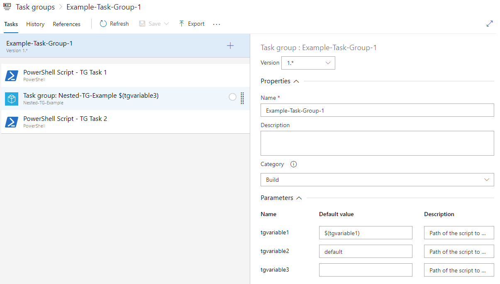
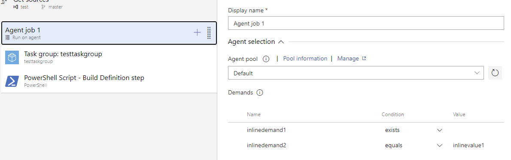
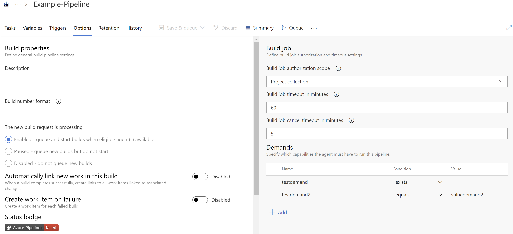

# Conversion of Classical Pipelines to YAML pipelines & Task Groups to Yaml templates

The main driver for combining this toolset was to automate the steps to convert classical pipelines (aka Build / Release Definitions) as well as Task Groups into YAML Pipelines / YAML Templates. This functionality mimics the 'View YAML' button inside steps / jobs. when doing a migration for a customer from classical to YAML pipelines I noticed how Azure DevOps does not provide a full experience.

Curently when you want to migrate a classical to YAML pipeline in Azure Devops it has to be done manually. You have the 'View YAML' button in classical pipelines for single steps which will give you the code for that particular step. However it does not work when you are selecting a Task Group step inside your classical pipeline. Furthermore useful properties such as triggers, variables, schedules, options and source options are not available from the Azure DevOps UI.

This means you are left with a lot of manual labor by having to select each and every step inside a single pipeline add it to a YAML file and when there are Task Groups in the mix you would need to open them one by one and copy the single steps inside them and paste them. Then you would have to add the other very important properties of a pipeline yourself to that same YAML file you are trying to make.

This is not only tedious and prone to errors but if you have invested a lot of time and effort into Task Groups as a mean to 'Create Once, Use Many' philosophy in CI/CD best practices you would like to convert those to YAML Templates files and call them from your YAML Pipeline.

This module does exactly that and automatically. It currently has two main features:

- Convert Task Groups to YAML step templates
  - steps: Iterates over steps and add them to the template
    - inputs used in steps that are currently in the variable format $(variable) and are no [predefined variables](https://docs.microsoft.com/en-us/azure/devops/pipelines/build/variables?view=azure-devops&tabs=yaml) will be converted into ${{parameter.parametername}}
  - Task Groups: When a Task Group is found it can either be added as \-template: or be expanded and added as \-task:
  - Inputs: Task Group Inputs are converted to template parameters
- Convert Build Definitions to YAML Pipelines including pipelines properties such as:
  - Triggers: (both Path and Branch)
  - Schedules: (already converted into CRON and UTC w/o DST)
  - Variables: (Secret variables are skipped and settable at queue time will be converted to pipeline parameters)
  - Agent Pools: (both at job and pipeline level)
  - Jobs: (and interdependendancies between them such as dependancies and conditions)
  - steps: (including non-default properties, inputs and conditions)
  - Task Groups: When a Task Group is found it can either be added as \-template: or be expanded and added as \-task:

The result of this conversion can either be used as a PSObject or be converted into a \*.yml file for direct usage. In the future I will create functionality to also import the results of the conversion as a new YAML Pipeline definition inside Azure DevOps. For items such as definition specific properties (triggers, schedules etc.) it will be an option to include them in the YAML file or you wish so (not recommended) have them be part of your YAML Pipeline definition.

## Usage

Below is explained how the module will do its work and what functions to call. No functions have pipeline support. I will be working on converting the module to have this as well as make use of Variable Sets, Classes and Types. I have just learned how this works in Powershell and did not want to halt the project on refactoring everthing.

### Task Group Conversion

In order to start with Task Group Conversion you will need a Powershell Array with Task Group names which you want to convert. This would look something like this: `$listofnames = @('Task Group 1', 'Task Group 2')`.

If you do not have this list available you can call `Get-AzDoAPIToolsDefinitonsTaskGroupNames -ApiType 'Taskgroup' -Projectname 'Project on AzDo'` to get a list of names.

Optionally you can provide the `-Profilename 'profile'` to address a specific profile saved in your `config.json`. By default it will pick the first entry in the `config.json` if not specified.

---

you will need to feed this array into `Get-AzDoAPIToolsDefinitionsTaskGroupsByNamesList` adding the array as `-nameslist $listofnames` and using `-apitype 'Taskgroup' -projectname 'Project on AzDo'`. Optionally you can use the `-profilename` to specify a different profile. this function knows a set of switches which can be called optionally:

- `-includeTGdrafts` : if your nameslist has Task Groups which are in draft the draft version will be included into the output of this function. This means you could have duplicate names in your resulting array which can cause overwritten files. It is best to seperate Draft Task Groups in a seperate nameslist or use `Get-AzDoAPIToolsDefinitionsTaskGroupsByID`
- `-includeTGpreview` : If your nameslist includes Task Groups of which you have a preview currently it will be taken into account when using this switch. By default the function will try to determine the highestversion of a task group and will exclude previews and only use stable versions. If you want your task groups to be converted if a preview is available use this switch to allow the highestversion of a Task Group to be a preview version.
- `-AllTGVersions` : For converting Task Groups it is not recommended to use this switch. Using this switch will return all versions of the task group in nameslist which will lead to duplicates. It might be useful for other puroposes but not for converting. By default the function will return the highest version of a Task Group.

Alternatively if you have an ID of a single Task Group or if you need a specific version / Draft of a task group other than the highest version you can use `Get-AzDoAPIToolsDefinitionsTaskGroupsByID -ID <id> -ApiType 'Taskgroup' -projectname 'Project on AzDo'` It knows the same three switches as mentioned in `Get-AzDoAPIToolsDefinitionsTaskGroupsByNamesList` but also features `-TGVersion <int>` to retrieve a specific version of a Task Group (see example below)

These functions will add some necessary MetaData as well as the actual definition to a PSObject which then can be used by subsequent functions which actually convert your Build Definition or to extract parts of it.

By running either function and assigning it to a variable you are now ready to convert one or more Task Groups to YAML Templates.

---

use `Get-AzDoAPIToolsTaskGroupAsYAMLPrepped -TaskGroupsToConvert $arrayresult -projectname 'Project on AzDo'` To output the YAML Prepped PSObject for a Task Group. You can use `-profilename` to specify a different profile.

if you specify the `-ExpandNestedTaskGroups` switch every 'nested Task Group' inside The current Task Group to be converted will be expanded into \- task: steps rather than \- template: calls to other Task Groups. However you want to use it is up to you.

#### Sidenote on Task Group Versions

The Template referenced / expanded will be of the version which is being used by the initiating Task Group. That could result in expanding different versions of Task Groups if you have configured it like so. When not using this switch and using different versions of a Task Group it will only refer to the version of the originating task group you converted. See below example.

Say you have 2 Task Groups referencing Different versions of another Task Group:

- Task Group 1 : References Task Group 3 Version 1
- Task Group 2 : References Task Group 3 Version 2

When __not__ using the `-ExpandNestedTaskGroups` both converted Task Group 1 & 2 will have a \-template: Task Group 3.yml reference. The reference to the template used will be dependant to which version of Task Group 3 you have converted into a \*.yml file. __Both will refer to the same version__.

If you had used the `-ExpandNestedTaskGroups` switch Task Group 1 would have the expanded steps of Task Group 3 Version 1 whereas Task Group 2 would have the expanded steps of Task Group 3 Version 2.

If you need different versions of templates you will need to convert both templates with `Get-AzDoAPIToolsDefinitionsTaskGroupsByID -TGVersion` and apply some manual labor. For the module it is impossible to convert this granularity without some manual labor. Maybe I will include the version number as a part of the filename when exporting in the future.

#### Sidenote on Template Usage

When referencing to (nested) Task Groups the module assumes that you have all templates in the same directory. If you wish to store your templates in a different directory that is possible. Any references to existing templates in the form of \- template: taskgroup.yaml need to be changed to be prefixed with a pathname. The converted YAML templates ofcourse need to be present in the mentioned path.

If you wish to store your templates in a seperate repository you need to add a [repository resource](https://docs.microsoft.com/en-us/azure/devops/pipelines/yaml-schema?view=azure-devops&tabs=schema%2Cparameter-schema#repository-resource) component to the YAML file and suffix the reference to the YAML template with a `@aliastoexternalresource`.

#### Converting to YAML

With these settings the function will output a PSObject with the YAML Prepped properties and values. If you wish to output it as a YAML file you need to use the `-Outputasfile` switch. If you do you will also need to specify the `-OutputPath` argument with a filepath to which the task groups are saved. By default the filename will be \<Name of Task Group\>.yml.

### Build Definition conversion

For converting Classical Build Definitions we have two options to consider:

- Convert a complete Build Definition into a \*.yml file
- Extract parts of a build definition (such as triggers, schedules etc.) if you only specific components of a build definition to a PSObject which is YAML Prepped.

Both Functionality is roughly the same and the build up in using is roughly the same.

---

In order to start with Build Definition Conversion you will need a Powershell Array with Build Definition names which you want to convert. This would look something like this: `$listofnames = @('Build Definition 1', 'Build Definition 2')`.

If you do not have this list available you can call `Get-AzDoAPIToolsDefinitonsTaskGroupNames -ApiType 'Builddefinition' -Projectname 'Project on AzDo'` to get a list of names.

Optionally you can provide the `-Profilename 'profile'` to address a specific profile saved in your `config.json`. By default it will pick the first entry in the `config.json` if not specified.

---

you will need to feed this array into `Get-AzDoAPIToolsDefinitionsTaskGroupsByNamesList` adding the array as `-nameslist $listofnames` and using `-apitype 'Builddefinition' -projectname 'Project on AzDo'`. Optionally you can use the `-profilename` to specify a different profile.

Alternatively if you have an ID of a single Build Definition you want to convert you can use `Get-AzDoAPIToolsDefinitionsTaskGroupsByID -ID <id> -ApiType 'Builddefinition' -projectname 'Project on AzDo'`

These functions will add some necessary MetaData as well as the actual definition to a PSObject which then can be used by subsequent functions which actually convert your Build Definition or to extract parts of it.

#### Converting a complete Build Definition

use `Get-AzDoAPIToolsDefinitionAsYAMLPrepped -DefinitionsToConvert $arrayresult -projectname 'Project on AzDo'` To output the YAML Prepped PSObject for a Build Definition. You can use `-profilename` to specify a different profile.

if you specify the `-ExpandNestedTaskGroups` switch every 'nested Task Group' inside The current Build Definition to be converted will be expanded into \- task: steps rather than \- template: calls to other Task Groups. However you want to use it is up to you.

See the [Sidenote on Task Group Versions](#Sidenote-on-Task-Group-Versions) in the Task groups section to have an explanation of different Task group versions. Also have a look at [Sidenote on Template Usage](#Sidenote-on-Template-Usage)

With these settings the function will output a PSObject with the YAML Prepped properties and values. If you wish to output it as a YAML file you need to use the `-Outputasfile` switch. If you do you will also need to specify the `-OutputPath` argument with a filepath to which the converted Build Definitions are saved. By default the filename will be \<Name of Build Definiton\>.yml.

#### Extracting a specific component of a Build Definition

You can use one of below functions to retrieve a specific component of a Build Definition and have it YAML Prepped for you. Input for each function would be the array of PSObjects retrieved either by `Get-AzDoAPIToolsDefinitionsTaskGroupsByNamesList` or `Get-AzDoAPIToolsDefinitionsTaskGroupsByID`. Though it is recommended to use these for single Build Definition since the output does not contain any metadata to relate it to a Build Definition.

This section is all about usage of the functions. See [Examples](#Examples) to see how conversion is done.

##### Schedules

Use `Get-AzDoAPIToolsDefinitionSchedulesAsYAMLPrepped -InputDefinitions <array of build definitions>`.

The result is a YAML prepped PSObject which contains Properties according to the [YAML Schema on Schedules](https://docs.microsoft.com/en-us/azure/devops/pipelines/yaml-schema?view=azure-devops&tabs=schema%2Cparameter-schema#scheduled-trigger)

##### Steps

Use `Get-AzDoAPIToolsDefinitionStepsAsYAMLPrepped -InputDefinitions <array of build definitions>`. Since this functions needs to call other parts of Azure DevOps it is neccessary to include the `-Projectname <project on AzDo>` to specify which project to refer to.

You can use the `-profilename <profile alias>` argument to specify a different profile if applicable. To convert references Task Groups inside the definition to separate steps use the `ExpandNestedTaskGroups` switch.

The result is a YAML prepped PSObject which contains Steps according to the [YAML Schema on Steps](https://docs.microsoft.com/en-us/azure/devops/pipelines/yaml-schema?view=azure-devops&tabs=schema%2Cparameter-schema#steps). If your definitions contain multiple jobs or if your job uses a different agent pool as defined on pipeline level this function will include a jobs / job construct according to the [YAML Schema on Jobs](https://docs.microsoft.com/en-us/azure/devops/pipelines/yaml-schema?view=azure-devops&tabs=schema%2Cparameter-schema#job) including any job properties which were defined in the Build Definiton.

##### Triggers

Use `Get-AzDoAPIToolsDefinitionTriggersAsYAMLPrepped -InputDefinitions <array of build definitions>`.

The result is a YAML prepped PSObject which contains Push / CI Triggers according to the [YAML Schema on Push Triggers](https://docs.microsoft.com/en-us/azure/devops/pipelines/yaml-schema?view=azure-devops&tabs=schema%2Cparameter-schema#push-trigger)

##### Variables (& Parameters)

Use `Get-AzDoAPIToolsDefinitionVariablesAsYAMLPrepped -InputDefinitions <array of build definitions>`.

Secret Variables are skipped. if your variable has the property 'Settable at queue time'. If you have any variable group(s) linked they will be referenced in the YAML output.

The result is a YAML prepped PSObject which contains Parameters according to the [YAML Schema on Parameters](https://docs.microsoft.com/en-us/azure/devops/pipelines/yaml-schema?view=azure-devops&tabs=schema%2Cparameter-schema#parameters) as well as Variables according to the [YAML Schema on Variables](https://docs.microsoft.com/en-us/azure/devops/pipelines/yaml-schema?view=azure-devops&tabs=schema%2Cparameter-schema#variables)

---

The results as mentioned are PSObjects so they are not yet converted to YAML. If you wish to do so you can either pipe them to `ConvertTo-Yaml` to use the [Powershell-YAML](https://github.com/cloudbase/powershell-yaml) module to convert them to YAML in your PS Session. If you want the output as a \*.yml file you can use `Convert-AzDoAPIToolsYamlObjectToYAMLFile -InputObject $PSOBjectYouWantToConvert -outputpath 'Path to export to' -outputfilename 'filename.yml'`.

### Release definition conversion

This is not yet supported. See [Limitations](#manual-stages-in-Release-definitions) for the reason why it is not supported.

## Examples

This section has some examples on how Task Groups and Build Definitions are converted by the module and shows example results.

### Example Task Group Conversion

For demonstrating this purpose i have created two task groups:


*Task Groups Example*

__Example-Task-Group-1__ contains two tasks and in between a nested task group __Nested-TG-Example__. __Nested-TG-Example__ on its turn has one task:


*Example Task Group 1*


*Nested Task Group*

We can also see that the original Task group has 3 inputs. tgvariable1 & tgvariable2 are included because of the tasks itself inside the original task group. tgvariable3 comes with that because the Nested Task Group has it as an input.

So let's see how this converts to YAML :) There are two ways to approach this. With and without `-ExpandNestedTaskGroups` switch.

#### Without expansion

if we would run the functions in this module without the `-ExpandNestedTaskGroups` for both task groups we would get 2 \*.yml files:

- Example-Task-Group-1.yml
- Nested-TG-Example.yml

`Example-Task-Group-1.yml` would look like this in YAML syntax:

```yaml
parameters:
- name: tgvariable1
  type: string
- name: tgvariable2
  type: string
- name: tgvariable3
  type: string
steps:
- task: PowerShell@2
  displayName: PowerShell Script - TG Task 1
  inputs:
    filePath: ${{parameters.tgvariable1}}
- template: Nested-TG-Example.yml
  parameters:
    tgvariable3: ${{parameters.tgvariable3}}
- task: PowerShell@2
  displayName: PowerShell Script - TG Task 2
  inputs:
    filePath: ${{parameters.tgvariable2}}
```

We can see that the converted Task groups has 3 parameters as input. Since Task Groups inputs are always strings they are typed as such. We can see that the same three inputs are available as inputs as we would have in the Classical Task Group.

Also notice that there are no default values assigned. The way Default values work for Classical Task Groups is that they form a suggestion when you add them to your Build / Release Definition. The function of this module is to convert existing Task Groups and Build / Release Definitons. That means that wherever you reference a Task group you have provided the inputs you want. The sole purpose of these YAML templates is to 'Create once, Use Many'. By removing the default values you are being made concious about what you would need to fill when calling them. Also when you are converting Build Definitions which call a Task Group the inputs you have assigned to the template are also converted.

Furthermore we can see that the steps of this YAML template are exactly as in the original Task group. except that calling another Task Group is replaced with the \- template: construct in providing the Nested YAML template. That would require you to also convert the nested TG as a YAML Template.

`Nested-TG-Example.yml` would look like this in YAML syntax:

```yaml
parameters:
  name: tgvariable3
  type: string
steps:
  task: PowerShell@2
  displayName: PowerShell Script - Nested TG Task 1
  inputs:
    filePath: ${{parameters.tgvariable3}}
```

in the Nested Template we can see a single parameter and a single task. which is exactly what is in the Classical Task group. Since it is being called by the original YAML Template the steps inside this Nested template will be expanded when Azure DevOps expands the complete pipeline at queue time.

You should not use Task group Expansion when you have a complex set of Task Groups which you want to template out as YAML templates for reusability. Bear in mind that if you version your Task Groups and [are in needed of multiple versions](#Sidenote-on-Task-Group-Versions) at the same time you might want to convert multiple versions of the task groups used and apply different names manually and change the references to the yaml templates. The same applies when you want to [centralize your templates](#Sidenote-on-Template-Usage) in one or more repo's. You will need the add resource constructs to the pipelines calling the templates and update the references to the called templates.

---

#### With expansion

When we would have the `-ExpandNestedTaskGroups` switch present it means that all nested task groups will be expanded and put in place where the call to that template was. If we were to convert both Task Groups again in our example we would get the following two files:

- Example-Task-Group-1.yml
- Nested-TG-Example.yml

`Example-Task-Group-1.yml` would look like this in YAML syntax:

```yaml
parameters:
- name: tgvariable1
  type: string
- name: tgvariable2
  type: string
- name: tgvariable3
  type: string
steps:
- task: PowerShell@2
  displayName: PowerShell Script - TG Task 1
  inputs:
    filePath: ${{parameters.tgvariable1}}
- task: PowerShell@2
  displayName: PowerShell Script - Nested TG Task 1
  inputs:
    filePath: ${{parameters.tgvariable3}}
- task: PowerShell@2
  displayName: PowerShell Script - TG Task 2
  inputs:
    filePath: ${{parameters.tgvariable2}}
```

The difference with not using the `-ExpandNestedTaskGroups` is that the contents of the Nested Task Group are placed instead of calling the Converted YAML file for the Nested Task Group with the \- template: construct. If the Nested Task groups would have had multiple steps or even Nested Task Groups of itself they would also be expanded and put in the right order. The converted Task Group will have all paramaters from all nested task groups added to the list.

`Nested-TG-Example.yml` would look like this in YAML syntax:

```yaml
parameters:
  name: tgvariable3
  type: string
steps:
  task: PowerShell@2
  displayName: PowerShell Script - Nested TG Task 1
  inputs:
    filePath: ${{parameters.tgvariable3}}
```

We can see that this file is exactly the same as in the example without using the `-ExpandNestedTaskGroups` switch. And since it is already present in expanded form in the original converted Task Group this converted Task group would initially have no extra value unless you would add it to a YAML definition or another YAML Template by hand. There might be special occasions where you would want a scenario like this which is why I included the functionality.

Use the `-ExpandNestedTaskGroups` switch if you want to simplify and or merge various Task groups together in a single template. Be aware that this functionality is situational and that it should fit your strategy.

---

### Example Build Definition conversion

Let's have a look at below classical pipeline and deduct all GUI components and how they will look after conversion:


*Example Pipeline with a nested Task group*

So let's start with the name of the pipeline: Example-Pipeline. The filename after conversion of this pipeline will be Example-Pipeline.yml

We can see that the Pipeline section is highlighted. We can see that the default agent pool in this pipeline is VS2017-Win2016 and is a Microsoft hosted Azure Devops agent.

after conversion that will look like:

```yaml
pool:
  vmImage: vs2017-win2016
```

---


*sources properties*

Looking at the Sources section we can see several checkout options. Currently these will be ignored. This is on the [ToDo list](#Apply-resource-checkout-options). After conversion it should look like this:

```yaml
steps:
- checkout: self | none | repository name
  clean: true | false
  fetchDepth: number
  lfs: true | false  
  submodules: true | recursive
  path: string
  persistCredentials: true | false
```

---


*Job properties part1*

*Job properties part 2*

On to the agent job specific settings we can see that a custom pool is being used. More specifically the Default Pool. Also we can see two demands for the agents. Demands will be converted for Agent Jobs only. They are [best used](https://docs.microsoft.com/en-us/azure/devops/pipelines/process/demands?view=azure-devops&tabs=yaml) in Self-Hosted agents but are also supported for MS Hosted agents. in the second image we can see that there are no dependancies and other properties are default. Since this job uses a different agent pool as the pipeline we can't omit the jobs / job section in YAML and as such the result will be converted like this:

```yaml
jobs:
- job: job_1
  displayName: Agent Job 1
  pool:
    name: Default
  demands:
  - inlinedemand1
  - inlinedemand2 -equals inlinevalue1
  - testdemand
  - testdemand2 -equals valuedemand2
```

Notice how the extra demands 'testdemand' & 'testdemand2 -equals valuedemand2'. These come from the options tab (see below) of the pipeline itself. The job name you have configured in the UI will be used as the displayName property and the actual job name will be the internal ID from the REST API.

---


*Original steps of build definition*


*Referenced Task Group from Build Definition*


*Nested Task Group in referenced Task Group*

Looking at the steps we can see that the Build Definition itself contains a step and a task group. Conversion of these steps would look like this if we did not use `-ExpandNestedTaskGroups`:

```yaml
steps:
  - template: testtaskgroup.yml
  - task: PowerShell@2
    displayName: PowerShell Script - Build Definition step
    inputs:
      script: |
        # Write your PowerShell commands here.

        Write-Host "Hello World actual Step in Build Def"
      targetType: inline
```

If we would have used the `-ExpandNestedTaskGroups` we can see the full chain of steps all in the correct order:

```yaml
steps:
  - task: PowerShell@2
    displayName: PowerShell Script - Task Group Step
    inputs:
      script: |
        # Write your PowerShell commands here.

        Write-Host "Hello World Task Group test"
      targetType: inline
  - task: PowerShell@2
    displayName: PowerShell Script - Nested Task Group Task
    inputs:
      script: |
        # Write your PowerShell commands here.

        Write-Host "Hello World Nested TG Test"
      targetType: inline
  - task: PowerShell@2
    displayName: PowerShell Script - Build Definition step
    inputs:
      script: |
        # Write your PowerShell commands here.

        Write-Host "Hello World actual Step in Build Def"
      targetType: inline

```

---


*Variable settings*


*Linked Variable Group(s)*

On to the Variables tab in the build definition. We can see that we have 1 secret variable, 1 static variable, 1 variable settable at queue time and 1 linked variable group. When converted this will be the output:

```yaml
parameters:
- name: parametervar
  type: string
  default: testvalue
variables:
- name: system.debug
  value: "false"
- name: statictestvar
  value: staticvalue
- group: testgroup
```

We can see that the secret var is skipped, the settable var is included as a parameter, the static variable is in the variables section and that we have 1 linked variablegroup.

Oddly enough system.debug is not considered a predefined variable whereas the others are. these variables come with every pipeline generated in the UI. I'm still deciding whether i should ignore the system.debug variable since we have a diagnostics button in YAML pipelines which does the same.

---


*CI triggers*

We have 1 included branch to trigger on, 2 paths to filter on (1 included, 1 excluded) and Batch changes is checked. This would become the following YAML:

```yaml
trigger:
  branches:
    include:
    - refs/heads/master
  paths:
  - include:
    - pathtoinclude
  - exclude:
    - pathtoexclude
  batch: true
```

---

There are 4 schedules in this job to demonstrate the timezone corrections we have to do for the expected CRON notation:


*Schedule with minus offset*

The First Schedule is set at 01:00 (AM) on Saturday on master branch with a UTC - 9 offset. This means that 9 hours will be added to the schedule. Since the new time is on the same day no shift in days is expected. After conversion this will become Saturday 10:00 (AM):

```yaml
- cron: 0 10 * * 6
  branches:
    include:
    - refs/heads/master
```


*Schedule with Daylight Savings Time*

The Second Schedule is set at 19:07 (7:07 PM) on all days except for sunday on master branch with a UTC + 1 offset. At the time of writing this Timezone has Daylight Savings Time applied and the actual offset to UTC is +2. Despite this correction on DST it should not be reflected in the CRON YAML schedule notation. Therefor the applied schedule should be running on all days except sunday at 18:07 (6:07 PM):

```yaml
- cron: 7 18 * * 1,2,3,4,5,6
  branches:
    include:
    - refs/heads/master
```


*Schedule on UTC, Exclusion and always triggered*

The Third Schedule is set at 06:00 (AM) on every day of the week on every branch but master branch using UTC time. There should be no change to this schedule in the CRON YAML notation. However notice the checkbox for 'Only schedule builds if the source or pipeline has changed' being unchecked. This means that this schedule should always run regardless of the source code. The resulting schedule should have no shift in time, exclude the master branch and always run:

```yaml
- cron: 0 6 * * 0,1,2,3,4,5,6
  branches:
    exclude:
    - refs/heads/master
  always: "true"
```


*Schedule with plus offset*

The Fourth Schedule is set at 01:00 (AM) on weekdays on master branch with a UTC + 9 offset. This schedule demonstrates the shift in days because converting the schedule to UTC will extract 9 hours from the current time and would result in the UTC schedule running on the previous day at 16:00 (4:00 PM). this means that the weekday schedule will also shift one day left. The resulting schedule should run Sunday through Thursday at 16:00 (4:00 PM):

```yaml
- cron: 0 16 * * 0,1,2,3,4
  branches:
    include:
    - refs/heads/master
```

The complete schedule section will look like this for the four schedules mentioned in this example:

```yaml
schedules:
- cron: 0 10 * * 6
  branches:
    include:
    - refs/heads/master
- cron: 7 18 * * 1,2,3,4,5,6
  branches:
    include:
    - refs/heads/master
- cron: 0 6 * * 0,1,2,3,4,5,6
  branches:
    exclude:
    - refs/heads/master
  always: "true"
- cron: 0 16 * * 0,1,2,3,4
  branches:
    include:
    - refs/heads/master
```

---


*Options tab*

On the options tab there is not much we need to take into consideration. If you have a custom Build number format it will copied as:

```yaml
name: $(buildid)-custompart-example
```

if the Build Number format field is empty we default to the `$(buildid)`. It can be omitted because it is a default value but I've chosen to make it clear this can be customizable:

```yaml
name: $(buildid)
```

Other settings like timeoutinminuts and jobcanceltimeout which are mentioned here are valid for every job inside the Build Definition. I guess I could apply them to every job inside the pipeline if they are not the default settings. This is not implemented yet. See [this topic](https://docs.microsoft.com/en-us/azure/devops/pipelines/process/phases?tabs=yaml&view=azure-devops#timeouts) by Microsoft to see the correct YAML notation if you wish to apply it yourself. If you have specified a Job timeout in the Job part of the pipeline for that specific job it will be converted as a job property.

The demands specified here will be copied over to each job using a Microsoft-Hosted or Self-Hosted Agent.

## Assumptions

Some assumptions had to be made while developing this module. Below is the explanation of these assumptions.

### Schedules are converted to UTC notation disregarding DST

When converting schedules from the built-in GUI editor to CRON notation inside YAML I had to follow the guidelines which are stated [here](https://docs.microsoft.com/en-us/azure/devops/pipelines/process/scheduled-triggers?view=azure-devops&tabs=yaml#migrating-from-the-classic-editor). These instructions tells us that schedules in YAML pipelines are expected as CRON notation, but more notably in UTC format. In the classical pipeline you can determine in which timezone OffSet you want to run the schedule. In YAML there is no such way and it expects a UTC based notation.

DayLightSaving corrections are ignored by YAML pipelines. e.g CEST will not be +2 based on UTC but rather +1 (based of the non-DST timezone CET). Converted schedules are formatted as UTC w/o DST correction. This might mean that the schedule in the YAML file has a different day / time as configured in the GUI pipeline. this is all based on the [guidelines for manually converting schedules to YAML notation](https://docs.microsoft.com/en-us/azure/devops/pipelines/process/scheduled-triggers?view=azure-devops&tabs=yaml#migrating-from-the-classic-editor)

#### Example

Schedule on Tokyo Time (UTC + 9) on Saturday at 1:00 (AM) means it needs to be corrected with -9 hours to be in UTC. Your converted YAML Schedule in CRON will read Friday 16:00 (PM) (0 16 \* \* 5)

similarly if you use an Alaska Time (UTC - 9) schedule on Saturday 22:00 (10:00 PM) it means the timezone correction will be + 9 instead. The Cron notation will instead be Sunday 07:00 (AM) (0 7 \* \* 0)

Daylight Saving Times will be ignored. This means if you specified Amsterdam in your pipeline it reads UTC + 1. During winter this means this will be CET (UTC + 1) timezone. in Summertime this will be CEST timezone (UTC + 2). Schedules which are specified in the Build Definition which are curently in their DST format will still be considered as if they were running winter time. In our example for Amsterdam CEST only 1 hour will be substracted from the original schedule instead of 2.

### Variables settable at queue time --> Parameters

Classical Pipelines know variables. One particular property of a variable in classical pipelines is the ability to override values for variables at queue time rendering them into sort of parameters. With YAML Pipelines we now have the option to actually declare parameters in our yaml file. Variables (declared in a yaml file, not in definitions) are always static.

The assumption is that if you have declared any variables with the property 'Settable at queue time' you want them to be turned into YAML parameters.

If the module is expanded and the adding of converted yaml pipeline definitions (not the *.yml file itself but its definition) becomes available i might consider exporting variables into the definition rather than the yaml file (see next assumption)

### Definition specific properties are supposed to be inside YAML files rathen then in the YAML definition

Now this needs some explanation... With classical pipelines you need to declare variables / triggers inside the Build / Release definition. However with YAML Pipelines you have the option to declare these in two possible ways:

- inside the YAML Pipeline definition (similar place as they would exist in a Build / Release definition)
- inside the YAML Pipeline itself (the *.yml file). These would become the trigger: / variables: properties of the YAML file.

The assumption from this tool is that users strive to use the best practices associated and that you want variables / triggers for your definition inside the yaml file rather than in the definition.

### Calls to other templates assume they are in the same folder as the calling YAML file

When converting Task Groups to YAML Templates they will be exported to a single output folder. If you have nested task groups or definitions caling task groups (and not using the ExpandNestedTaskgroups switch) the tool assumes the called / nested task group is in the same folder as its caller / parent. If you want to have this in a different way and use an external template repository you should add the resource for it, the path to where you store them and the @alias suffix yourself. When i have time I will attempt to add settings which will do these prefixes / suffixes based on a json file.

## Limitations

Some buyers beware and known limitations of this module due to the behavior of Azure DevOps and the differences in classical vs YAML pipelines. These limitations will not be solved unless Micrsosoft will update their product and if i can find a stable way to implement it.

### Incompatible tasks

If your task group contains a task which does not work with YAML pipelines expect your pipeline to crash on it. I noticed this first when running the [Add Tag](https://github.com/colindembovsky/cols-agent-tasks/tree/master/Tasks/TagBuild) task which can tag a release definition or build definition. Since YAML Pipelines are living in the 'Build' area of Azure DevOps it can't apply a tag to a release definition (since they no longer exist in YAML). These tasks are converted to YAML but will obviously fail when running the pipeline. Unfortunately it is quite impossible / undoable to determine if a custom task is YAML-proof.

### Secret variables

If you have any secret variables inside your Build / Release Definitions they will not be exported. Any calls or uses of these variables (in the $() format will be converted.). Since YAML is clear text it would not be advisable to store these secrets. Besides the default behavior of Azure DevOps is to not copy these over when cloning or importing a Build / Release Definition I decided not to convert them (technically also impossible).

My suggestion is you use the built-in functionality in the Definition settings or Azure Keyvault to store these secrets instead. If you name them similar as your original variables they will be accessible to converted tasks.

### Incompatible folders (predefined variables)

This predominantly concerns Tasks / Task Groups which are working in the Release Definition area. In YAML Pipelines all pipelines operate in the build area. Therefor Artifacts are downloaded to the path $(pipeline.workspace)\\\<Artifact ALias\>  directory Which translates to \<agentworkdir\>\\\<Artifact Alias\>. In Release definitions this would have been $(Release.ArtifactsDirectory) which tranlates to \<agentworkdir\>\\a\\\<artifact Alias\>. This means that all tasks that expect to work from the \a directory will not automatically work. Predefined variables which are affected are:

- $(System.defaultworkingdirectory)
- $(Release.ArtifactsDirectory)
- $(Agent.ReleaseDirectory)

Also this means that predefined variables which start with release.* will not work.

Since it is impossible for me to determine which task groups are used for which purpose in your use-case i opted for not converting these affected inputs to the $(pipeline.workspace). This might mean that your converted YAML pipeline will fail on folder errors / file not found errors.

If there is enough interest I can add a switch which does this for you though. Still it would mean manually flagging Task Groups which would need this behavior.

This will not fix the default behavior of some of your 3rd party extensions / tasks. some of these will prefix $(system.defaultworkingdirectory) if you provide a relative path as an input to a task. These will have to be fixed by the original author. In most tasks if you prefix $(pipeline.workspace)\\\<relative path\> it will work most of the times.

### Manual stages in Release Definitions

Currently Microsoft does not allow for manual triggered stages in YAML Pipelines. In Classical Pipelines it was possible to add multiple stages to your release definition which would not automatically trigger when a release was started. Instead you had to open up the newly created release and 'Deploy' to that stage. In YAML pipeline such a mechanic does not exist (yet).

This deficit means that if you make use of these manually triggered stages in your release definitions they will be exported as separate stages in the converted YAML file. However the behavior of YAML Pipelines is that all stages will run in parallel unless they have the dependsOn property. And even if that was declared it would still mean the stage would automatically execute. The only measure to prevent this would be to use manual approvals on an Environment. However this is still not a solution to this limitation.

My suggestion is not to convert those classical pipelines to YAML or find a way to parameterize your pipeline in combination with say conditions to mimic the intended behavior. This is clearly out of the scope of this tool since we do not want to make too much assumptions in how the user wants its target produce.

According to [this](https://developercommunity.visualstudio.com/idea/697467/manually-triggered-stages-in-yaml-multi-stage-pipe.html) Feature Request it is on the roadmap. According to [this](https://developercommunity.visualstudio.com/idea/629260/specify-manual-stages-in-multi-stage-yaml-pipeline.html) Feature request it is not. If you want to use Multi-Stage pipelines with manually triggered stages please upvote so Microsoft will prioritize this. If this gets implemented I will be adding conversion functionality for release definitions (some plumbing has already been done).

## ToDo list

Below is a short To Do list of functionality I wish to implement asap. the order in which they occur here is the priority I gave them.

### Apply resource checkout options

stuff like checkout: clean, LFS and other git options which are specified in a build definitions sources part needs to be translated to steps - checkout options.

### Converted parameters from queue time variables are called as variable instead of a parameter

When converting variables to parameters which have the AllowOveride property and are thus settable at queue time are put into the parameters section of the YAML file.

However when calling such parameter inside a step input it is being referred to as $(variablename) rather than $(parameters.variablename) / ${{parameters.variablename}}. This means an overhaul of the private `Get-TaskInputs` function and rethink the logic behind it.

### Adding converted Pipelines as actual definitions to Azure DevOps

right now the goal is to produce \*.yml files which then can be used to create a new pipeline in Azure DevOps via the 'New Pipeline' button. This will create a 'Build Definition' on the background which points to the created \*.yml file. It would be awesome if the user would not need to perform this manual step and have the already converted classical pipeline be automatically added as a new definition into Azure DevOps.

### Variables as Definition variables rather than YAML Template variables

As mentioned in the assumptions part of this readme right now Variables are assumed to be wanted as the variables: property inside a *.yml file. However even with YAML pipelines it is possible to have these variables defined as variables managed by Azure DevOps. If the option becomes available to add converted pipelines as a new definition the assumption on variables becomes a choice.

### support for TFS / Azure DevOps Server installations

Right now all the URL creation function allows for Azure DevOps URL creation. it does not support TFS / Azure DevOps Server local installation. In the case of TFS I am even unsure if YAML is supported at all. This needs further investigation.

### Support for TFVC, GitHub, BitBucket source

Right now the use-cases at the clients i've worked with was to deal with Azure DevOps hosted source code. I will need to do investigation / confirmation that this also works if you host your code externally and if not what changes are needed to incorporate this.

### Release Definitions

I wanted to push this Module to GitHub and make it publicly available knowing this feature was not implemented yet. The reason is that release definitions are quite complex and are not fully compatible between classical vs YAML Pipelines. This has to do predominantly with the [manual stages limitation](#Manual-stages-in-Release-Definitions). whenever Microsoft fixes this I will continue working on this. If interest is high enough I will make efforts into converting Classical Release Definitons to YAML pipelines knowing there is a serious limitation to the product by Microsoft.
